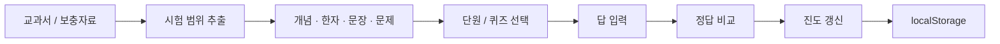

<div align="center">

# 🇨🇳 생활 중국어 기말고사 정리

### 시험 범위만 모아서, 바로 외우고 바로 풀기.

<p>
  
  
  
</p>

[Contents](#contents) · [Learning Flow](#learning-flow) · [Run](#run)

</div>

---

교과서와 보충자료를 계속 넘겨보는 대신, **시험에 실제로 필요한 내용만 작은 학습 단위로 묶어 반복하기 위해 만든 웹앱**입니다.

## Contents

| Area | Included |
|---|---|
| 발음 | 성조, 성모, 운모, 한어병음 표기 규칙 |
| 회화 | 인사·감사·사과, 이름·국적·인물 묘사 |
| 생활 표현 | 가족·나이·학년·숫자 |
| 암기 | 필수 한자 카드 38개 |
| 쓰기 | 수행평가 문장 20개 |
| 연습 | 실전 퀴즈, 중국 개관 암기 카드 |
| Progress | 브라우저 학습 진도 저장 |

## Learning flow



복잡한 추천 모델보다 **시험 범위를 잘게 나누고 학습 상태를 계속 남기는 것**이 핵심입니다. 새로고침해도 어디까지 공부했는지 다시 찾을 필요가 없습니다.

## Run

```bash
npm install
npm run dev
```

Production build:

```bash
npm run build
```

`main` 브랜치에 푸시하면 GitHub Actions를 통해 GitHub Pages에 배포할 수 있습니다.

## Stack

`TypeScript` · Static Web App · `localStorage` · GitHub Pages
